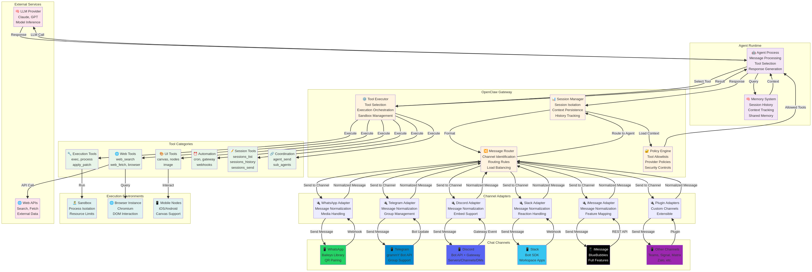
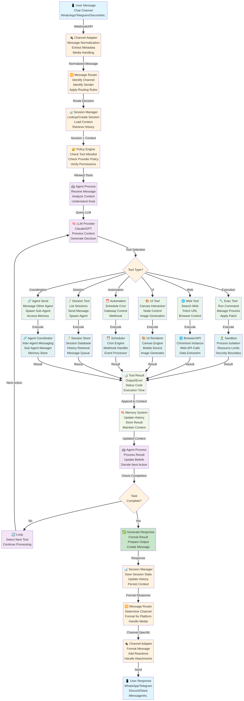
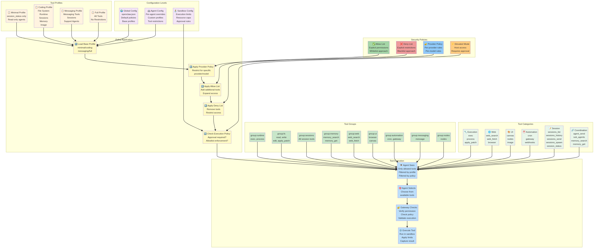

# OpenClaw AI: Architecture, Agent Flow, and Design Decisions

## Introduction

The promise of AI agents has always been to automate complex tasks across the tools we already use. Yet most AI agent frameworks are either cloud-dependent, limited to single platforms, or designed for chatbot interactions rather than true autonomous execution. **OpenClaw** represents a fundamentally different approach: a self-hosted, multi-channel gateway that connects your favorite chat applications—WhatsApp, Telegram, Discord, Slack, iMessage, and more—to powerful AI coding agents.

OpenClaw is an open-source (MIT licensed) project written in TypeScript that runs on Node.js. Rather than forcing users into a proprietary ecosystem, OpenClaw operates as a unified bridge between the chat platforms people already use and the AI agents that can perform meaningful work. Whether you're a developer building autonomous workflows, a power user seeking a personal AI assistant, or an organization deploying agents across teams, OpenClaw provides the infrastructure to make it happen.

This comprehensive guide explores OpenClaw's architecture, the internal mechanics of its agent flow, the design decisions that make it effective, and the implementation patterns that enable multi-channel agent deployment. We'll examine how OpenClaw unifies disparate chat platforms, how agents interact with tools and external systems, and how the system maintains security and isolation while enabling powerful automation.

---

## Part 1: The Multi-Channel Agent Problem

Before exploring OpenClaw's solution, it's important to understand the fundamental challenges in building truly multi-channel AI agents.

### The Platform Fragmentation Problem

Modern communication happens across dozens of platforms. Users message via WhatsApp, Telegram, Discord, Slack, iMessage, and countless others. Each platform has its own API, authentication mechanism, message format, and feature set. For developers building AI agents, this fragmentation creates a significant problem: to deploy an agent across multiple platforms, you must implement separate integrations for each one.

Traditional approaches to this problem are deeply flawed. Some solutions require users to move to a proprietary chat interface, abandoning the platforms they already use. Others implement only a single platform, forcing users to adopt new communication tools. Still others attempt to unify platforms but lose platform-specific features in the process.

### The Agent Architecture Challenge

Beyond platform fragmentation, building true AI agents that work across platforms requires solving several architectural problems. Agents need access to tools—the ability to execute code, search the web, interact with files, and coordinate with other agents. They need session management to maintain context across conversations. They need security controls to prevent misuse. And they need the ability to scale from personal use to enterprise deployment.

Most frameworks solve these problems in isolation. They provide tools but no multi-channel support. They support multiple channels but with limited agent capabilities. They offer security but at the cost of flexibility. OpenClaw addresses these challenges through a unified architecture that doesn't require compromise.

### The Self-Hosting vs. Cloud Trade-Off

A final challenge is the choice between self-hosted and cloud-based deployment. Cloud-based solutions offer convenience and scalability but require users to trust their data to third parties and pay ongoing subscription fees. Self-hosted solutions offer control and privacy but require users to manage infrastructure and deployment.

OpenClaw resolves this trade-off by making self-hosting the default. The Gateway runs on your own hardware or a VPS you control. You maintain full ownership of your data, your sessions, and your agent configurations. Yet OpenClaw is designed to be simple enough that self-hosting doesn't require deep infrastructure expertise.

---

## Part 2: OpenClaw's Architectural Foundation

OpenClaw addresses these challenges through a carefully designed architecture centered on the **Gateway**—a unified process that serves as the single source of truth for sessions, routing, and channel connections.

### The Gateway: The Central Hub

At the heart of OpenClaw's architecture is the **Gateway**, a TypeScript/Node.js process that runs on your machine or a server you control. The Gateway is not a proxy or a simple message forwarder. It's a sophisticated routing and session management system that understands the semantics of agent communication.

When a user sends a message via WhatsApp, the Gateway receives it through the WhatsApp channel integration. It extracts the message content, identifies the sender, and routes it to the appropriate agent based on configuration rules. The agent processes the message, selects tools to execute, and returns a response. The Gateway then sends the response back through the same channel, maintaining the user's context and session state.

This architecture has profound implications. Because the Gateway is the single source of truth, it can enforce consistent policies across all channels. It can maintain unified session management even though each channel has its own session model. It can coordinate multi-agent workflows where agents on different channels need to communicate. And it can enforce security policies uniformly across all platforms.

**Figure 1: OpenClaw Gateway Architecture**

The diagram above illustrates the complete Gateway architecture. Chat messages arrive through various channel adapters (WhatsApp, Telegram, Discord, Slack, iMessage, and others). These are normalized and routed through the message router. The session manager maintains isolated sessions and context. The policy engine enforces tool allowlists and security controls. The agent runtime processes messages and selects tools. Tools execute in appropriate environments (sandbox, browser, mobile nodes), and results flow back through the system to be formatted and sent back through the original channel.

### Multi-Channel Integration

OpenClaw supports an extensive list of chat platforms, each integrated through a channel-specific adapter. The supported channels include WhatsApp (using Baileys library with QR pairing), Telegram (via grammY bot API), Discord (using Discord Bot API and Gateway), Slack (via Bolt SDK), iMessage (recommended via BlueBubbles), Microsoft Teams, Signal, Google Chat, Mattermost, Matrix, Zalo, and many others. Plugin channels extend this list further, allowing community-driven integrations.

Each channel adapter handles the platform-specific details: authentication, message formatting, media handling, reactions, and group management. Yet from the Gateway's perspective, all channels present a unified interface. A message arrives, gets routed to an agent, and the response goes back through the same channel. This abstraction is crucial—it allows agents to operate without needing to know which platform they're communicating through.

The multi-channel architecture also enables sophisticated routing. The Gateway can route messages from different users to different agents. It can route messages from the same user to different agents based on content or context. It can route messages to multiple agents simultaneously for coordination. And it can maintain completely isolated sessions per agent, workspace, or sender, ensuring that conversations don't bleed across boundaries.

### The Agent Runtime

OpenClaw's agent runtime is designed specifically for coding agents—agents that can execute code, interact with files, search the web, and coordinate with other agents. The runtime provides a comprehensive set of first-class tools that agents can use directly.

The tool inventory includes execution tools (exec, process, apply_patch), web tools (web_search, web_fetch, browser), UI tools (canvas, nodes), media tools (image, message), automation tools (cron, gateway), session management tools (sessions_list, sessions_history, sessions_send, sessions_spawn, session_status), and agent coordination tools (agent_send, sub-agents). Each tool is typed and fully integrated into the agent's decision-making process.

Tools are not presented to the agent as a generic list. Instead, OpenClaw uses a sophisticated tool profile system that restricts which tools are available based on configuration. The built-in profiles include minimal (session_status only), coding (file system, runtime, sessions, memory, image), messaging (messaging tools only), and full (no restriction). Administrators can further customize tool availability per agent, per provider, or per provider/model combination.

This flexibility is crucial for security. Different agents have different needs. A support agent might only need messaging tools. A development agent might need full access to execution tools. An untrusted provider might be restricted to read-only file access. The tool profile system enables fine-grained control without requiring complex policy languages.

### Platform Support and Deployment

OpenClaw runs on multiple platforms: macOS (with a menu bar companion app), iOS and Android (with Canvas support for rich interactions), Linux, and Windows (via WSL2). The core Gateway is written in TypeScript and runs on Node.js, making it highly portable.

For deployment, OpenClaw supports local development, self-hosted servers, and VPS hosting. Popular hosting options include Fly.io (with auto-scaling), Hetzner (Docker-based), GCP (Compute Engine), and exe.dev (VM with HTTPS proxy). The Gateway can be installed as a system service (LaunchAgent on macOS, systemd on Linux) for always-on operation.

This deployment flexibility is a key design decision. Rather than forcing users into a specific hosting provider or infrastructure model, OpenClaw works with whatever deployment model makes sense for their use case. A developer might run it locally on their Mac. A small team might deploy it to a cheap VPS. An enterprise might run it on their own infrastructure. The architecture supports all these scenarios equally well.

---

## Part 3: Agent Flow and Message Processing

Understanding how messages flow through OpenClaw is crucial to understanding how the system works. The agent flow is a carefully orchestrated process that maintains context, enforces policies, and coordinates tool execution.

### Message Arrival and Channel Processing

The agent flow begins when a user sends a message through a chat channel. The message arrives at the Gateway through the channel-specific adapter. The adapter extracts the message content, identifies the sender, determines whether the message is in a group or direct message, and extracts any media or attachments.

For WhatsApp, this involves receiving a webhook from Baileys. For Telegram, it's a bot API update. For Discord, it's a Gateway event. For Slack, it's a webhook or socket message. Each channel has its own protocol, but the Gateway normalizes all of these into a unified message format.

**Figure 2: OpenClaw Agent Flow**

The diagram above shows the complete agent flow from message arrival to response delivery. A user sends a message through a chat channel. The channel adapter normalizes it. The message router identifies the recipient agent. The session manager loads context. The policy engine determines allowed tools. The agent processes the message, selects tools, and executes them in appropriate environments. Tool results are appended to context. The agent continues until the task is complete, then generates a response. The response is formatted for the channel and sent back to the user.

### Session Routing and Isolation

Once the message is normalized, the Gateway determines which agent should handle it. This routing decision is based on configuration rules that can consider the sender, the channel, the message content, and other factors. The Gateway then looks up or creates a session for this sender/agent combination.

Sessions are completely isolated. A user might have separate sessions with different agents. The same user might have separate sessions with the same agent on different channels. Each session maintains its own conversation history, context, and state. This isolation is critical for security and for preventing context bleed across different conversations.

### Agent Processing and Tool Selection

The message and session context are passed to the agent. The agent receives the message, reviews the conversation history, and decides what action to take. This might involve selecting a tool to execute, generating a response, or asking for clarification.

OpenClaw uses a tool selection mechanism that presents tools to the agent based on the configured tool profile. The agent sees only the tools it's allowed to use. This prevents agents from accidentally (or maliciously) attempting to use tools they shouldn't have access to.

### Tool Execution and Sandboxing

When an agent selects a tool, the Gateway executes it. Execution happens in a sandbox environment that isolates the tool from the rest of the system. For code execution tools (exec, process), this might be a Docker container or a separate process. For web tools (browser, web_search), this might be a managed browser instance or an API call. For UI tools (canvas, nodes), this might be a remote device or a local display.

The sandbox ensures that tool execution doesn't affect other agents or the Gateway itself. If an agent runs a command that crashes, it doesn't crash the Gateway. If an agent attempts to access files outside its allowed scope, the sandbox prevents it. This isolation is essential for running untrusted agents safely.

### Response Generation and Channel Delivery

Once tools have executed and the agent has processed the results, it generates a response. This response is formatted according to the channel's capabilities. A response for WhatsApp might include text and images. A response for Discord might include embeds and reactions. The Gateway handles all the channel-specific formatting.

The response is then sent back through the same channel to the user. The Gateway maintains the session context, so the user's next message will be associated with the same session and will include the full conversation history.

### Multi-Agent Coordination

For more complex workflows, OpenClaw supports multi-agent coordination. Agents can send messages to other agents using the agent_send tool. They can spawn sub-agents to handle specific tasks. They can access shared memory and session information. This enables sophisticated workflows where multiple agents collaborate to solve problems.

---

## Part 4: Tool System and Capabilities

OpenClaw's tool system is one of its most powerful features. Rather than limiting agents to a fixed set of capabilities, OpenClaw provides a comprehensive toolkit that agents can use to interact with the world.

### Core Tool Categories

The tool system is organized into several categories. **Execution tools** allow agents to run commands and manage background processes. The exec tool runs shell commands with configurable timeouts and background execution. The process tool manages background sessions, allowing agents to poll for output, write input, kill processes, and clear sessions. The apply_patch tool applies structured patches across multiple files, useful for code modifications.

**Web tools** enable agents to search and fetch information from the internet. The web_search tool queries Brave Search API for results. The web_fetch tool extracts readable content from URLs, converting HTML to markdown or text. Both tools support caching to reduce API calls and costs.

**UI tools** provide rich interaction capabilities. The browser tool controls a dedicated OpenClaw-managed browser instance, supporting navigation, screenshots, DOM interaction, PDF generation, and file uploads. The canvas tool provides a rich drawing and interaction surface. The nodes tool enables interaction with iOS and Android companion devices.

**Media tools** handle images and messages. The image tool generates images from descriptions. The message tool sends messages to users or other agents.

**Automation tools** enable scheduled and event-driven execution. The cron tool schedules tasks using cron expressions. The gateway tool provides access to gateway configuration and management.

**Session tools** manage conversation sessions. The sessions_list tool lists active sessions. The sessions_history tool retrieves conversation history. The sessions_send tool sends messages to other sessions. The sessions_spawn tool creates new sessions. The session_status tool checks session status.

**Agent coordination tools** enable multi-agent workflows. The agent_send tool sends messages to other agents. The sub-agents feature allows spawning child agents for specific tasks.

### Tool Profiles and Security

Rather than giving all agents access to all tools, OpenClaw uses a tool profile system. The minimal profile provides only session_status, suitable for read-only agents. The coding profile provides file system, runtime, sessions, and memory tools, suitable for development agents. The messaging profile provides only messaging tools, suitable for support agents. The full profile provides unrestricted access.

Administrators can further customize tool availability through allow and deny lists. These can be applied globally, per agent, or per provider/model combination. Provider-specific policies allow restricting tools for specific LLM providers, useful for managing costs or ensuring compliance with provider policies.

**Figure 3: OpenClaw Tool System and Security**

The diagram above illustrates the tool system and security architecture. Tool profiles provide base allowlists. Tool categories organize tools by function. Tool groups provide shortcuts for common combinations. Security policies further refine access. Configuration can be applied at global, agent, or sandbox levels. The policy application process applies these rules in sequence to determine which tools an agent can see and use.

This fine-grained control enables OpenClaw to support diverse use cases safely. A support agent can be restricted to messaging tools. A development agent can have full access. An untrusted provider can be restricted to read-only operations. The tool system adapts to the security requirements of each use case.

### Tool Execution and Policies

Tool execution is governed by several policies. The security policy determines whether tool execution requires approval, uses an allowlist, or has full access. The ask policy determines whether the agent must ask for permission before executing certain tools. The elevated policy determines whether tools can run with elevated privileges on the host system.

These policies work together to create a flexible security model. A development agent might have full access to execution tools. A user-facing agent might require approval for certain operations. An untrusted agent might be restricted to read-only operations. The policy system makes these distinctions clear and enforceable.

---

## Part 5: Design Decisions and Trade-Offs

OpenClaw's architecture reflects several important design decisions, each with implications for how the system behaves and what trade-offs it makes.

### Self-Hosted by Default

The most fundamental design decision is that OpenClaw is self-hosted by default. The Gateway runs on your own hardware or a server you control. You maintain full ownership of your data, your sessions, and your agent configurations.

This decision has significant implications. It means users don't need to trust OpenClaw with their data. It means there are no subscription fees or usage limits. It means users have complete control over their infrastructure. But it also means users are responsible for deployment, updates, and maintenance.

This trade-off is deliberate. OpenClaw targets developers and power users who are comfortable managing infrastructure. For this audience, self-hosting is a feature, not a burden. It provides the control and privacy they need.

### Multi-Channel Unification

A second key decision is to unify multiple chat platforms through a single Gateway. Rather than building a proprietary chat interface, OpenClaw works with the platforms users already use.

This decision has profound implications. It means agents can reach users wherever they are. It means users don't need to adopt new communication tools. It means the same agent can serve users across multiple platforms simultaneously. But it also means OpenClaw must implement and maintain integrations with many different platforms.

This trade-off reflects OpenClaw's philosophy: meet users where they are, rather than forcing them to come to you.

### Agent-Native Architecture

OpenClaw is designed specifically for agents, not for chatbots. This means the architecture assumes agents will use tools, maintain sessions, coordinate with other agents, and perform complex workflows. It's not optimized for simple question-answering or casual conversation.

This design decision shapes many aspects of the system. The tool system is comprehensive and typed. The session management is sophisticated. The agent coordination features are powerful. But the system is more complex than a simple chatbot framework would be.

This trade-off reflects OpenClaw's target use case: developers building autonomous agents that perform meaningful work.

### TypeScript/Node.js Stack

OpenClaw is written in TypeScript and runs on Node.js. This choice provides several benefits: strong typing for reliability, a large ecosystem of packages, cross-platform compatibility, and good performance for I/O-heavy workloads like managing multiple chat channels.

The trade-off is that Node.js is not the best choice for CPU-intensive workloads. For pure computational tasks, languages like Go or Rust might be better. But for OpenClaw's use case—managing channels, routing messages, coordinating tools—Node.js is well-suited.

### Plugin Architecture

OpenClaw uses a plugin architecture to extend functionality. Channels can be added as plugins. Tools can be added as plugins. Skills and slash commands can be added as plugins. This allows the community to extend OpenClaw without modifying the core codebase.

This design decision enables customization and extensibility. But it also adds complexity. The core system must be designed to support plugins, and plugins must follow certain conventions. This is a worthwhile trade-off for a system that needs to support diverse use cases.

### Security by Default

OpenClaw makes security decisions that prioritize safety over convenience. Tools are restricted by default. Elevated operations require explicit approval. Provider-specific policies can restrict capabilities. Auth monitoring can detect suspicious activity.

This approach means some legitimate operations might require additional configuration. But it means the default configuration is safe, even for untrusted agents or providers.

---

## Part 6: Implementation Patterns and Best Practices

Building effective agents with OpenClaw requires understanding several implementation patterns and best practices.

### Designing Agent Flows

Effective agent flows are designed with clear objectives and appropriate tool selection. An agent should know what it's trying to accomplish and have access to the tools it needs to accomplish it. Agents should not have access to tools they don't need, both for security and to reduce decision-making complexity.

A support agent might have access to messaging tools and session management tools, but not execution tools. A development agent might have access to execution and file system tools, but not messaging tools. This separation of concerns makes agents more focused and more secure.

### Managing Sessions and Context

Sessions are the mechanism by which OpenClaw maintains context across conversations. Effective session management requires understanding when to create new sessions, how to maintain context across sessions, and how to handle session isolation.

For most use cases, the default behavior is correct: each user gets a separate session with each agent. But for complex workflows, you might want to create additional sessions for sub-tasks or coordinate across multiple sessions.

### Coordinating Multiple Agents

OpenClaw supports sophisticated multi-agent workflows where agents can send messages to each other, spawn sub-agents, and access shared memory. Effective multi-agent coordination requires clear communication protocols and well-defined responsibilities.

A common pattern is to have a primary agent that receives user input and coordinates with specialized sub-agents. The primary agent might handle user interaction and routing, while sub-agents handle specific tasks like data analysis, code generation, or research.

### Handling Tool Errors and Failures

Tools can fail for many reasons: network errors, permission issues, timeouts, or invalid input. Effective agents handle these failures gracefully. They might retry operations, fall back to alternative approaches, or ask users for help.

OpenClaw preserves tool execution results in the conversation history, allowing agents to see what succeeded and what failed. This enables agents to learn from failures and adapt their approach.

### Scaling and Performance

OpenClaw is designed to scale from personal use to enterprise deployment. For personal use, running the Gateway on a local machine is fine. For team use, deploying to a VPS provides better availability. For enterprise use, running on dedicated infrastructure with monitoring and redundancy is appropriate.

Performance considerations include channel throughput (how many messages per second), agent processing time (how long agents take to respond), and tool execution time (how long tools take to complete). Monitoring these metrics helps identify bottlenecks and optimize performance.

---

## Part 7: Real-World Applications

OpenClaw's flexible architecture enables diverse applications across different domains.

### Personal Assistants

A personal assistant agent can monitor multiple channels (WhatsApp, Telegram, email) and respond to user requests. The agent might have access to web search, calendar integration, note-taking, and other personal productivity tools. Users can interact with their assistant through their preferred channel, and the agent maintains context across channels.

### Development Teams

A development team can deploy agents that assist with code review, testing, documentation, and deployment. These agents have access to execution tools, file system tools, and integration with development platforms. Developers can interact with these agents through Slack or Discord, keeping their workflow within their existing tools.

### Customer Support

A support team can deploy agents that handle common customer inquiries, route complex issues to humans, and maintain detailed session history. These agents have access to messaging tools, knowledge bases, and ticketing systems. Customers can interact through their preferred channel (WhatsApp, Telegram, etc.), and the agent provides consistent support across channels.

### Data Analysis and Reporting

Agents can perform data analysis, generate reports, and visualize results. These agents have access to web tools, execution tools, and image generation. They can be triggered on a schedule (via cron) or on demand, and they can deliver results through multiple channels.

### Automation and Integration

Agents can automate repetitive tasks and integrate disparate systems. An agent might monitor email (via Gmail PubSub), extract information, perform processing, and update a database. Another agent might monitor a webhook, trigger a workflow, and send notifications through multiple channels.

---

## Part 8: Challenges and Limitations

While OpenClaw is powerful, it has limitations and challenges that users should understand.

### Infrastructure Management

Self-hosting means users are responsible for infrastructure. They must ensure the Gateway is running, handle updates, manage backups, and monitor performance. For users without infrastructure expertise, this can be challenging.

OpenClaw provides tools to help (service installation, health checks, doctor command), but infrastructure management remains a user responsibility.

### Channel Integration Complexity

Each chat platform has its own quirks and limitations. WhatsApp requires QR pairing and stores state on disk. Telegram has rate limits. Discord has permission models. iMessage requires BlueBubbles. Integrating with all these platforms means handling their individual complexities.

OpenClaw abstracts these complexities, but they still exist. Users deploying to multiple channels should understand the specific requirements and limitations of each platform.

### Agent Decision-Making

Agents are only as good as the language models they use and the tools they have access to. Agents can make mistakes, misunderstand requests, or select inappropriate tools. Building effective agents requires careful design, testing, and monitoring.

### Cost and Resource Usage

Running a Gateway requires compute resources. Running agents requires API calls to language models. These costs can add up, especially for high-volume use cases. Users should monitor usage and optimize where possible.

---

## Part 9: Future Directions

OpenClaw is actively developed and has exciting directions for the future.

### Enhanced Agent Capabilities

Future versions will likely include more sophisticated agent reasoning, better tool selection mechanisms, and improved error handling. As language models improve, agents will become more capable and more reliable.

### Expanded Platform Support

OpenClaw continues to add support for new chat platforms. Future versions will likely include platforms that don't yet have integrations.

### Improved Developer Experience

Tools for building, testing, and deploying agents will continue to improve. Better debugging, monitoring, and testing frameworks will make it easier to build effective agents.

### Enterprise Features

Enterprise deployments will benefit from improved security controls, audit logging, multi-tenancy support, and advanced monitoring and alerting.

---

## Conclusion

OpenClaw represents a fundamentally different approach to building multi-channel AI agents. By combining a self-hosted Gateway, multi-channel support, powerful tools, and flexible security controls, OpenClaw enables developers and organizations to deploy agents that work across the platforms users already use.

The architecture reflects careful design decisions that prioritize control, flexibility, and security. The agent flow is sophisticated enough to handle complex workflows while remaining simple enough for straightforward use cases. The tool system provides powerful capabilities while maintaining security through fine-grained access control.

For developers building autonomous agents, teams deploying agents across organizations, and users seeking personal AI assistants, OpenClaw provides a powerful and flexible platform. By understanding OpenClaw's architecture, agent flow, and design decisions, you can build effective agents that solve real problems across the platforms that matter to you.

The future of AI is not centralized chatbots in proprietary interfaces. It's agents that meet users where they are, that have access to powerful tools, and that maintain full control of their data and infrastructure. OpenClaw is leading the way toward that future.

---

## References

1. OpenClaw Official Documentation - https://docs.openclaw.ai/
2. OpenClaw GitHub Repository - https://github.com/openclaw/openclaw
3. OpenClaw Tools Documentation - https://docs.openclaw.ai/tools
4. OpenClaw Chat Channels - https://docs.openclaw.ai/channels
5. OpenClaw Platforms - https://docs.openclaw.ai/platforms
